# PCN Triage Orchestrator

<p align="center">
  
</p>

<p align="center">
  <a href="https://www.python.org/"></a>
  <a href="https://github.com/google/adk-python"></a>
  <a href="https://www.google.com/aclk?sa=L&ai=DChsSEwihgIrFs8GWAxVW0BYFHXquFBgYACICCAEQABoCdGw&co=1&ase=2&gclid=CjwKCAjwwL_UBhAjEiwAEhuT5OR5NzyRvCL1Jm6sfB7MydIxq850eHu8dM8ZokEinHLUEe1LrhezOhoCgtwQAvD_BwE&cid=CAASWuRolKzCU85YNIH08vwzi5fSprEB1LC1HNYq8tlNX4k0LqSsNT-t0lrtl7-3OuspF673u8mSduFPAnbFm38R22jARs16PDtt-6sJB4rIbxWdC_IaFrh5xRRCHg&cce=2&category=acrcp_v1_37&sig=AOD64_2T4DpUTN3iCxH8tBQ3j8uZWkiSQg&q&nis=4&adurl&ved=2ahUKEwjKrIPFs8GWAxXTs1YBHZ0DF44Q0Qx6BAgXEAE"></a>
  <a href="https://cloud.google.com/"></a>
  <a href="https://fastapi.tiangolo.com/"></a>
</p>

**An autonomous, multi-agent pipeline that reads incoming Product Change Notifications, triages affected components, and ships firmware fixes — with no human in the loop.**

Built using Google ADK 2.0, Gemini 3.5 Flash, Eventarc, Gmail API, Pub/Sub, Firestore, and Cloud Run.

> [!NOTE]
> This README documents the system exactly as built and verified in production, including the real bugs found during live testing and how each was fixed. Every claim below is backed by a real Cloud Run log, Firestore document, or GitHub PR — screenshotted inline, not just asserted.

---

## Table of Contents

1. [Prerequisites](#prerequisites)
2. [Environment Variables](#environment-variables)
3. [Infrastructure Provisioning Guide](#infrastructure-provisioning-guide-from-scratch)
4. [Local Development](#local-development)
5. [Testing / How to Verify It Works](#testing--how-to-verify-it-works)
6. [Overview](#overview)
7. [The Problem](#the-problem)
8. [Key Features](#key-features)
9. [Architecture Decisions & Rationale](#architecture-decisions--rationale)
10. [Tech Stack](#tech-stack)
11. [Project Structure](#project-structure)
12. [Architecture Diagrams](#architecture-diagrams)
13. [Example Run](#example-run)
14. [Security & Cost Safety Nets](#security--cost-safety-nets)
15. [Known Limitations](#known-limitations)
16. [Operational Maintenance](#operational-maintenance)
17. [Cost Considerations](#cost-considerations)
18. [Technologies Used](#technologies-used)
19. [Findings & Learnings](#findings--learnings)

---

## Prerequisites

1. **gcloud CLI** — [Install](https://cloud.google.com/sdk/docs/install), then:
   ```bash
   gcloud auth login
   gcloud config set project <your-gcp-project-id>
   ```
2. **Python 3.11+**
3. **A GCP project** with billing enabled and the infrastructure described below.
4. **A GitHub account** with a target repository and a fine-grained Personal Access Token.

## Environment Variables

Copy `.env.example` to `.env` and fill in real values. **Never commit `.env`.**

| Variable | Description |
|---|---|
| `GCP_PROJECT_ID` | Your GCP project ID |
| `GCP_REGION` | GCP region (e.g. `asia-south1`) |
| `GITHUB_TOKEN` | Fine-grained PAT, `Contents: write` + `Pull requests: write` on the target repo only |
| `GITHUB_TARGET_REPO` | Target repo for HAL updates (`owner/repo` or full HTTPS URL) |
| `GMAIL_CLIENT_ID` | OAuth 2.0 client ID |
| `GMAIL_CLIENT_SECRET` | OAuth 2.0 client secret |
| `GMAIL_REFRESH_TOKEN` | Refresh token from `scripts/gmail_oauth_setup.py` |
| `GMAIL_WATCHED_ADDRESS` | Gmail address being watched |
| `ALLOWED_SENDERS` | Comma-separated authorized sender addresses; all others rejected before any processing |
| `GMAIL_PUBSUB_TOPIC` | Full topic name (`projects/<project>/topics/<topic>`) |
| `GCS_RAW_DOCUMENTS_BUCKET` | Bucket for raw PDF uploads |
| `GCS_ECO_OUTPUTS_BUCKET` | Bucket for generated ECO PDFs |
| `SERVICE_URL` | Each service's own Cloud Run URL, used as OIDC audience — set per service, re-verify after every redeploy |

> [!CAUTION]
> Cloud Run occasionally reports a different canonical URL format for the same service across deploys. A stale `SERVICE_URL` causes silent `401` OIDC audience-mismatch errors on both the ingestor's Pub/Sub endpoint and the agent's Eventarc endpoint — the deploy itself succeeds, so this failure mode is easy to miss. Always re-check with `gcloud run services describe <service> --format="value(status.url)"` after redeploying.

---

## Infrastructure Provisioning Guide (From Scratch)

Run in order. Skip entirely if this infrastructure already exists.

> [!IMPORTANT]
> Authenticate first with `gcloud auth login`.

### 1. Enable APIs & Set Project

```bash
gcloud config set project <your-gcp-project-id>

gcloud services enable \
  run.googleapis.com \
  eventarc.googleapis.com \
  pubsub.googleapis.com \
  storage.googleapis.com \
  firestore.googleapis.com \
  aiplatform.googleapis.com \
  gmail.googleapis.com \
  iamcredentials.googleapis.com \
  cloudresourcemanager.googleapis.com
```

### 2. Provision Storage & Database

> [!TIP]
> A 7-day lifecycle policy on both buckets auto-deletes raw PCNs and generated ECOs, keeping storage cost near zero regardless of test volume.

```bash
gcloud storage buckets create gs://pcn-raw-documents --location=asia-south1
gcloud storage buckets create gs://eco-outputs --location=asia-south1

gcloud firestore databases create --location=asia-south1 --type=firestore-native

echo '{"rule":[{"action":{"type":"Delete"},"condition":{"age":7}}]}' > lifecycle.json
gcloud storage buckets update gs://pcn-raw-documents --lifecycle-file=lifecycle.json
gcloud storage buckets update gs://eco-outputs --lifecycle-file=lifecycle.json
rm lifecycle.json
```

<p align="center">
  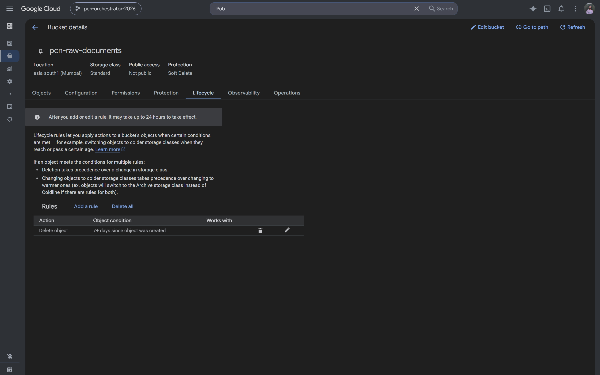
  <br>
  <em>The 7-day delete rule live on <code>pcn-raw-documents</code>.</em>
</p>

### 3. Service Account

```bash
gcloud iam service-accounts create pcn-agent-sa \
  --display-name="PCN Agent Service Account"

gcloud projects add-iam-policy-binding <your-gcp-project-id> \
  --member="serviceAccount:pcn-agent-sa@<your-gcp-project-id>.iam.gserviceaccount.com" \
  --role="roles/aiplatform.user"

gcloud projects add-iam-policy-binding <your-gcp-project-id> \
  --member="serviceAccount:pcn-agent-sa@<your-gcp-project-id>.iam.gserviceaccount.com" \
  --role="roles/datastore.user"

gcloud projects add-iam-policy-binding <your-gcp-project-id> \
  --member="serviceAccount:pcn-agent-sa@<your-gcp-project-id>.iam.gserviceaccount.com" \
  --role="roles/storage.admin"
```

> [!WARNING]
> No service account key files are ever created. This project relies entirely on Application Default Credentials — GCP org policy commonly blocks key creation (`iam.disableServiceAccountKeyCreation`), and skipping key files entirely avoids the risk of a leaked credential file regardless of policy. See Local Development for auth without keys.

### 4. Deploy Stub Services (reserve Cloud Run URLs)

```bash
gcloud run deploy pcn-ingestor \
  --source ./ingestor --region asia-south1 --no-allow-unauthenticated \
  --project <your-gcp-project-id>

gcloud run deploy pcn-agent \
  --source ./agent --region asia-south1 --no-allow-unauthenticated \
  --project <your-gcp-project-id>
```

Grant `pcn-agent-sa` invoker rights on both — without this, the locked-down services reject every caller, including Eventarc and Pub/Sub themselves:

```bash
gcloud run services add-iam-policy-binding pcn-ingestor \
  --member="serviceAccount:pcn-agent-sa@<your-gcp-project-id>.iam.gserviceaccount.com" \
  --role="roles/run.invoker" --region=asia-south1

gcloud run services add-iam-policy-binding pcn-agent \
  --member="serviceAccount:pcn-agent-sa@<your-gcp-project-id>.iam.gserviceaccount.com" \
  --role="roles/run.invoker" --region=asia-south1
```

Fetch each canonical URL (needed below):
```bash
gcloud run services describe pcn-ingestor --region=asia-south1 --format="value(status.url)"
gcloud run services describe pcn-agent --region=asia-south1 --format="value(status.url)"
```

<p align="center">
  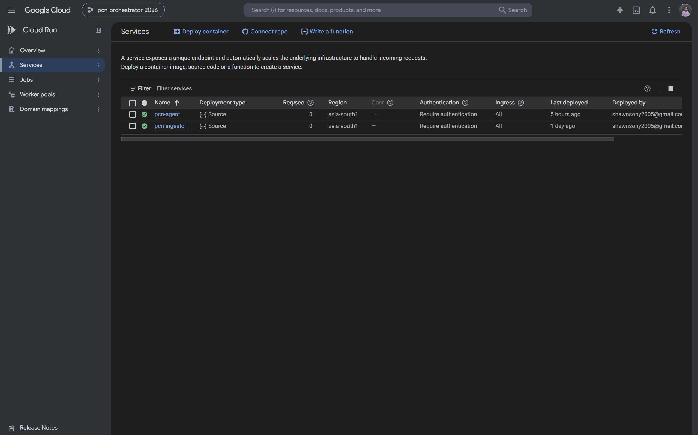
  <br>
  <em>Both services live, both requiring authentication — nothing is publicly reachable.</em>
</p>

### 5. Eventarc Trigger (GCS → `pcn-agent`)

```bash
gcloud eventarc triggers create pcn-gcs-trigger \
  --location=asia-south1 \
  --destination-run-service=pcn-agent \
  --destination-run-region=asia-south1 \
  --event-filters="type=google.cloud.storage.object.v1.finalized" \
  --event-filters="bucket=pcn-raw-documents" \
  --service-account="pcn-agent-sa@<your-gcp-project-id>.iam.gserviceaccount.com"
```

> [!IMPORTANT]
> The trigger's service account must be `pcn-agent-sa`, not the default compute service account. It already has `run.invoker` on `pcn-agent` from step 4; the default compute SA does not, and using it here fails silently against a locked-down service.

<p align="center">
  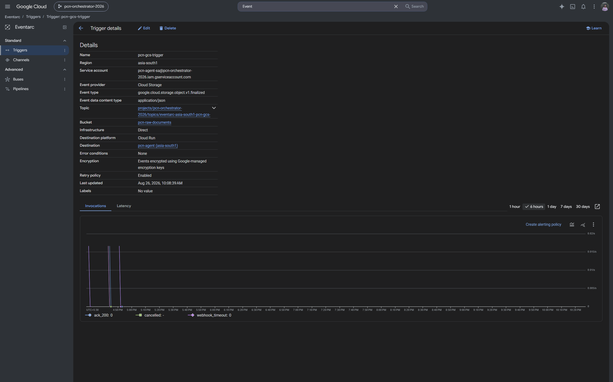
  <br>
  <em>Confirms <code>pcn-agent-sa</code> as the trigger's identity — not the default compute service account.</em>
</p>

### 6. Gmail API + Pub/Sub Ingestion Setup

**6a. OAuth consent screen + client:** GCP Console → APIs & Services → OAuth consent screen: User Type **External**, Testing mode, add the Gmail address to watch as a **test user**. Then Credentials → Create Credentials → OAuth client ID → **Desktop app**. Download the JSON into `secrets/`.

**6b. One-time local authorization:**
```bash
pip install google-auth-oauthlib google-auth google-api-python-client
python scripts/gmail_oauth_setup.py secrets/<downloaded_client_secret>.json
```
Log in as the watched address when the browser opens. Save the printed `GMAIL_CLIENT_ID` / `GMAIL_CLIENT_SECRET` / `GMAIL_REFRESH_TOKEN` into `.env`.

**6c. Pub/Sub topic and permissions:**
```bash
gcloud pubsub topics create gmail-pcn-notifications --project=<your-gcp-project-id>

gcloud pubsub topics add-iam-policy-binding gmail-pcn-notifications \
  --member="serviceAccount:gmail-api-push@system.gserviceaccount.com" \
  --role="roles/pubsub.publisher" --project=<your-gcp-project-id>

gcloud pubsub subscriptions create gmail-pcn-sub \
  --topic=gmail-pcn-notifications \
  --push-endpoint=<pcn-ingestor URL from step 4>/ \
  --push-auth-service-account="pcn-agent-sa@<your-gcp-project-id>.iam.gserviceaccount.com" \
  --project=<your-gcp-project-id>
```

<p align="center">
  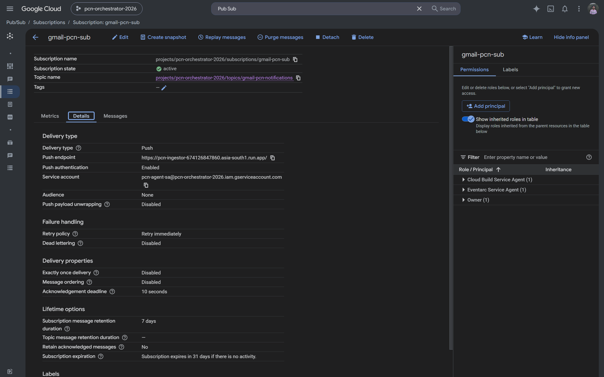
  <br>
  <em>Push endpoint and push-auth service account confirmed on <code>gmail-pcn-sub</code>.</em>
</p>

**6d. Register the watch:**
```bash
export GMAIL_CLIENT_ID=... GMAIL_CLIENT_SECRET=... GMAIL_REFRESH_TOKEN=... GCP_PROJECT_ID=<your-gcp-project-id>
python scripts/gmail_watch_renew.py
```
Expires in ~7 days — see Operational Maintenance.

### 7. GitHub Access

Create a fine-grained PAT scoped to the target repo only, with `Contents: write` and `Pull requests: write`. Add to `.env` as `GITHUB_TOKEN`.

### 8. Seed Inventory (for testing)

```bash
export GCP_PROJECT_ID=<your-gcp-project-id>
python scripts/seed_inventory.py
```

### 9. Deploy Real Services

```bash
gcloud run deploy pcn-ingestor --source ./ingestor --region asia-south1 --no-allow-unauthenticated \
  --project <your-gcp-project-id> \
  --set-env-vars="GCS_RAW_DOCUMENTS_BUCKET=pcn-raw-documents,GMAIL_CLIENT_ID=...,GMAIL_CLIENT_SECRET=...,GMAIL_REFRESH_TOKEN=...,GMAIL_WATCHED_ADDRESS=...,ALLOWED_SENDERS=...,SERVICE_URL=<pcn-ingestor URL>"

gcloud run deploy pcn-agent --source ./agent --region asia-south1 --no-allow-unauthenticated \
  --project <your-gcp-project-id> \
  --set-env-vars="GCP_PROJECT_ID=<your-gcp-project-id>,GCP_REGION=asia-south1,GCS_RAW_DOCUMENTS_BUCKET=pcn-raw-documents,GCS_ECO_OUTPUTS_BUCKET=eco-outputs,GITHUB_TOKEN=...,GITHUB_TARGET_REPO=...,SERVICE_URL=<pcn-agent URL>"
```

> [!CAUTION]
> Re-check `SERVICE_URL` after every `--source` redeploy — see the note under Environment Variables above.

---

## Local Development

**Authenticate via ADC impersonation** (no key files, ever):
```bash
gcloud auth application-default login \
  --impersonate-service-account=pcn-agent-sa@<your-gcp-project-id>.iam.gserviceaccount.com
```
Requires `roles/iam.serviceAccountTokenCreator` on `pcn-agent-sa` for your own user account (project owners typically already have this implicitly).

**Run locally:**
```bash
# Ingestor
cd ingestor && pip install -r requirements.txt
set -a && source ../.env && set +a
uvicorn main:app --reload --port 8081

# Agent (separate terminal)
cd agent && pip install -r requirements.txt
set -a && source ../.env && set +a
uvicorn main:app --reload --port 8082
```

---

## Testing / How to Verify It Works

The most reliable end-to-end test mirrors production exactly:

1. **Send a test email.** Attach a PDF from `test_pdfs/` to an email from an `ALLOWED_SENDERS` address, to `GMAIL_WATCHED_ADDRESS`.

<p align="center">
  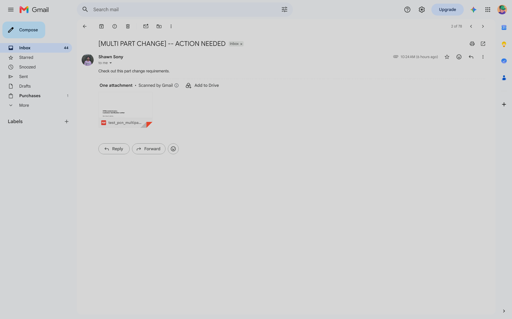
  <br>
  <em>A real trigger — email with a multi-part PCN PDF attached.</em>
</p>

2. **Watch it live:**
   ```bash
   gcloud run services logs read pcn-ingestor --region=asia-south1 --project=<your-gcp-project-id> --limit=30
   gcloud run services logs read pcn-agent --region=asia-south1 --project=<your-gcp-project-id> --limit=30
   ```
   Expect ingestor logs showing the push received, sender check passed, PDF uploaded. Agent logs showing `[TRIAGE]` → `[RESOLUTION]` → `[ACTION]` in sequence.
3. **Check Firestore** — `agent_runs` should have a new document with a populated `extracted_parts` array.
4. **Check GitHub** — a new PR, branch named `pcn/<part_number>-<hash>`.
5. **Check GCS `eco-outputs`** — a new `ECO-<timestamp>.pdf`.

`test_pdfs/` covers every code path:

| File | Exercises |
|---|---|
| Text-based, single part | Baseline pipeline correctness |
| Scanned, zero-text-layer, single part | Native multimodal reading (not text extraction) |
| Single part, deliberately not in Firestore | `NO_INVENTORY_MATCH` path, no fabricated replacement |
| 3-page, two parts (one seeded, one not) | Multi-page reading + independent per-part resolution in one document |

<p align="center">
  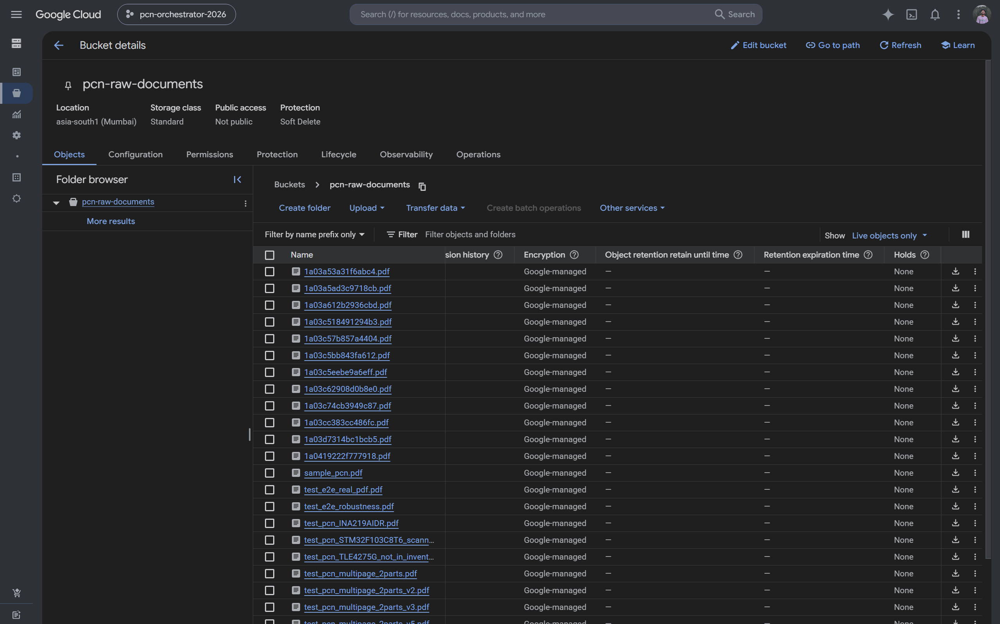
  <br>
  <em>Every test PDF used in verification, landed in <code>pcn-raw-documents</code> via real Gmail triggers and direct uploads.</em>
</p>

**Redelivery protection test:** re-upload the same GCS object twice in quick succession (or resend the same email). Confirm the second Eventarc delivery is logged as `Duplicate delivery skipped`, not reprocessed — visible directly in the log excerpt under [Example Run](#example-run).

To test the ingestor's Pub/Sub handling directly:
```bash
curl -X POST http://localhost:8081/ \
  -H "Content-Type: application/json" \
  -H "Authorization: Bearer <valid-oidc-token>" \
  -d '{"message": {"data": "<base64-encoded-json>", "messageId": "1", "publishTime": "2026-01-01T00:00:00Z"}, "subscription": "projects/<project>/subscriptions/gmail-pcn-sub"}'
```

---

## Overview

The PCN Triage Orchestrator watches a Gmail inbox for incoming Product Change Notification (PCN) emails, reads any attached PDF **natively** via Gemini's multimodal capability — including genuinely scanned, image-only documents with zero extractable text — cross-references every affected part number against a Firestore inventory, and autonomously opens GitHub Pull Requests updating firmware HAL headers plus generates Engineering Change Order (ECO) PDFs. No human touches anything between an email arriving and a PR appearing on GitHub.

## The Problem

Hardware and firmware teams receive PCNs constantly — manufacturers discontinuing parts, changing specs, or announcing end-of-life timelines. Triaging one manually means: read the PDF, identify the affected part, check whether your design even uses it, find a pin-compatible replacement, update the firmware header, and file the paperwork. Multiply that by every PCN a mid-size hardware team receives in a year, and it's a real, recurring chore — exactly the kind of messy, multi-step, low-glamour work an autonomous agent is well suited to handle end to end, not just talk about.

## Key Features

- **Fully autonomous, asynchronous pipeline** — email in, PR out, zero manual steps
- **Native multimodal PDF reading** — handles scanned, image-only PCNs with no text layer, not just clean text-based ones (proven in production, see Findings & Learnings)
- **Multi-page, multi-part support** — a single PCN document can name several affected parts; each is triaged independently
- **Honest failure reporting** — if a part isn't in inventory, the system says so explicitly (`NO_INVENTORY_MATCH`) rather than fabricating a replacement
- **Idempotent by design** — safe against Pub/Sub and Eventarc's at-least-once delivery guarantees; a redelivered event is detected and skipped, not silently reprocessed
- **Fully keyless, locked-down infrastructure** — no service account key files anywhere, both Cloud Run services reject all unauthenticated traffic
- **Structured, queryable audit trail** — every run's outcome is a structured Firestore document, not a prose blob

---

## Architecture Decisions & Rationale

This section exists because most of these decisions were **not** the first thing built — they're the result of hitting a real problem in production and choosing a specific fix. Documenting the reasoning, not just the final state, is deliberate: it's the clearest way to show engineering discipline rather than just claim it.

### Why manual 3-stage orchestration instead of ADK's `SequentialAgent`

"Manually orchestrated" does **not** mean any human is involved at runtime — the pipeline remains fully autonomous end to end. It refers to how the *Python code* manages the AI agents internally.

The original design used ADK's built-in `SequentialAgent` to chain Triage → Resolution → Action automatically. Empirical testing during development revealed a real limitation: if `SequentialAgent` fails partway through (e.g. a transient GitHub API timeout during Stage 3), it cannot resume mid-sequence on retry — `InMemorySessionService` doesn't provide the resumable-session backend that would require. A naive outer retry loop around a failed `SequentialAgent` run would re-invoke **every** stage from the beginning, including the expensive, multimodal Stage 1 PDF read, every single time any later stage failed transiently.

The fix: three independent `Agent` + `Runner` pairs (Triage, Resolution, Action), explicitly sharing one `session_id`, with each stage's JSON output parsed in code and deliberately re-injected as the next stage's `new_message` — rather than relying on ADK's automatic chaining. This guarantees a failure in Stage 3 retries *only* Stage 3.

This is not a theoretical claim — it happened for real in production. A crash inside `github_create_pr` (see Findings & Learnings) triggered exactly this retry path, and the logs show only Stage 3 re-executing, with Stages 1 and 2's Gemini calls never repeated:
```
ERROR:google_adk...: Root node action_agent failed. AssertionError
WARNING:main:[ACTION] Retry attempt 2/3 after transient error, retrying in 1s:
INFO:google_adk...: Sending out request, model: gemini-3.5-flash ...
INFO:tools: Creating PR on shawnsony07/pcn-orchestrator-2026 ...
```
No `[TRIAGE]` or `[RESOLUTION]` log lines appear between the failure and the successful retry — proof the isolation works as designed, under a real failure, not a simulated one.

### Why native multimodal PDF reading instead of text extraction

An early version of the ingestion pipeline extracted PDF text locally (via `pypdf`) and passed only that text to Gemini. This has a hard failure mode: a scanned or image-only PCN — extremely common in the real world, since manufacturers often send faxed or scanned notices — returns empty text, and the LLM has nothing to reason from.

Worse, this exact gap caused a real hallucination early in development: given only a bare GCS URI as a text string with no way to actually read the referenced PDF, the agent invented a plausible-sounding but entirely fabricated part number (`BME280`) that didn't correspond to what was actually in the test document (`INA219AIDR`). Nine pull requests were opened against fabricated data before this was caught. See Findings & Learnings for the full account.

The fix: pass the PDF directly to Gemini via `Part.from_uri(gcs_uri, mime_type="application/pdf")` — genuine multimodal input, not a text proxy. This was verified against a PDF built specifically to have **zero extractable text** (confirmed via `pypdf` returning 0 characters across all pages) and Gemini correctly read the part number, manufacturer, and replacement directly from the rendered image.

<p align="center">
  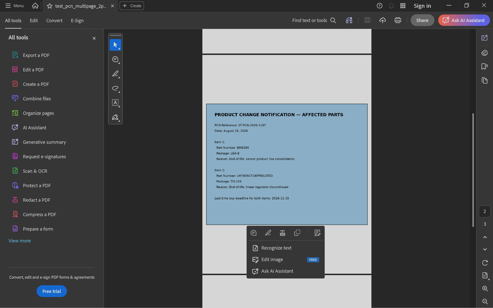
  <br>
  <em>Proof it's a genuine image scan, not styled text — Adobe itself offers "Recognize text" (OCR) on this selection, which only appears when there's no real text layer to select.</em>
</p>

### Why not-in-inventory reports failure explicitly, never a guess

Directly downstream of the hallucination above: `query_firestore_inventory` returns a strict `{"found": false}` on no match, and the Resolution/Action stage instructions explicitly forbid inventing a replacement in that case. `NO_INVENTORY_MATCH` is a first-class, expected outcome — not an error to hide. This was validated in production against a deliberately unseeded part number (`TLE4275G-LEGACY` / `LM7805CT-DEPRECATED` across multiple test runs), and the pipeline correctly reported no match with no fabricated PR every time.

### Why idempotency is checked before Stage 1, not just inside the PR tool

Pub/Sub and Eventarc both use **at-least-once delivery** by design — Google's own documented behavior, not a bug. The same event can and will be redelivered. This was caught directly in production logs: a single GCS upload triggered the entire pipeline twice, ~19 seconds apart, doubling Gemini spend and producing a redundant ECO PDF for one input.

The first fix attempt only protected the GitHub PR step (deterministic branch naming meant a second run reused the same branch instead of opening a duplicate PR) — but that's too late; Stages 1 and 2 had already run twice by the time that protection kicked in. The real fix moved the check to the very top of `receive_event()`: before Stage 1 is ever invoked, Firestore is checked for an existing `agent_runs` document with the same `gcs_uri` in a terminal state. If found, the entire pipeline is skipped and logged as a duplicate delivery, confirmed working in production (see the log excerpt in [Example Run](#example-run)).

### Why deterministic PR branch naming, not LLM-chosen names

Early runs let the model choose branch names freely, which produced inconsistent, occasionally nonsensical names across retriggers of the same document (`bme280-to-bme688`, `BME280-replacement-v3`, `update-BME280-hal-v2` — nine variants for what should have been one PR). The fix: branch names are computed deterministically in code — `pcn/<part_number>-<sha256(gcs_object_name)[:6]>` — never left to model discretion. This also makes the idempotency guarantee concrete: the same source document always maps to the same branch.

### Why the GitHub Contents API instead of a local git clone

`github_create_pr` uses `PyGithub`'s Contents API (`repo.update_file()`/`repo.create_file()`) rather than cloning the repo locally with `GitPython`. This avoids needing a `git` binary baked into the container image, avoids local filesystem cleanup, and is sufficient for the current single-file-per-part HAL update case. The tradeoff, made deliberately and documented rather than hidden: each modified file produces its own commit, not one atomic multi-file commit. Acceptable today; would need a Git Data (Trees) API rewrite if multi-file atomic commits become a requirement.

### Why Gmail API + Pub/Sub instead of SendGrid Inbound Parse

The original plan used SendGrid Inbound Parse for email ingestion, which requires an MX record on an owned domain. No owned domain was available (a GitHub Pages subdomain doesn't count — GitHub controls that DNS, not the project). The pipeline was re-architected around Gmail's native `users.watch()` + Pub/Sub push instead, which needs no domain at all and, as a side effect, keeps the entire stack on Google-native services rather than introducing a third-party dependency.

### Why fully keyless (ADC-only) authentication

No service account key JSON files exist anywhere in this project, locally or in production. Partly a policy constraint — the GCP organization enforces `iam.disableServiceAccountKeyCreation` — and partly a deliberate choice: keyless auth via Application Default Credentials (impersonation locally, attached identity on Cloud Run) removes an entire class of credential-leak risk that a downloaded key file introduces.

---

## Tech Stack

| Component | Selection | Why |
|---|---|---|
| Agent Framework | Google ADK 2.0 (Python) | Native tool-calling, multimodal support |
| Model | `gemini-3.5-flash` via Vertex AI | Fast, cost-efficient, native PDF/image multimodal input |
| Ingestion | Gmail API `users.watch()` → Pub/Sub push → Cloud Run | No domain required; fully Google-native |
| Event Routing | Google Cloud Eventarc | Serverless GCS-finalize → Cloud Run trigger |
| State / Memory | Firestore (Native mode) | Structured, queryable run history and inventory |
| Compute | Cloud Run (two services) | Scale-to-zero, container-native, locked-down IAM |
| Web Framework | FastAPI | Both services |

---

## Project Structure

<p align="center">
  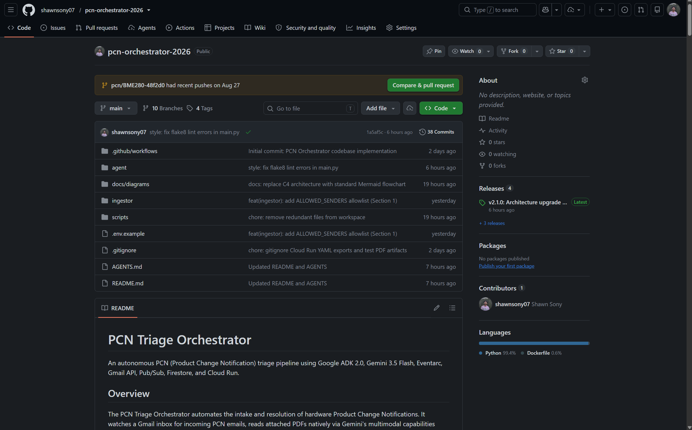
  <br>
  <em>The live repository — commits, releases, structure.</em>
</p>

```text
pcn-orchestrator-2026/
├── ingestor/                     # Gmail push receiver → GCS upload service
│   ├── main.py                   # FastAPI: Pub/Sub push, sender allowlist, Gmail fetch, GCS upload
│   ├── requirements.txt
│   └── Dockerfile
├── agent/                        # Eventarc handler + multi-agent triage pipeline
│   ├── main.py                   # FastAPI: Eventarc trigger, idempotency check, 3-stage orchestration
│   ├── tools.py                  # Firestore inventory query, GitHub PR creation, ECO PDF generation
│   ├── requirements.txt
│   └── Dockerfile
├── scripts/
│   ├── gmail_oauth_setup.py      # One-time interactive OAuth authorization (run once, locally)
│   ├── gmail_watch_renew.py      # Non-interactive weekly watch() renewal
│   └── seed_inventory.py         # Seeds the Firestore `inventory` collection with test parts
├── test_pdfs/                    # Sample PCN PDFs covering every code path (see Testing section)
├── outputs/                      # Real ECO PDFs generated by the agent during live runs
├── docs/
│   ├── diagrams/                 # Mermaid diagram sources (.mmd) + rendered PNGs
│   └── images/                   # README screenshots
├── secrets/                      # gitignored — Gmail OAuth client JSON, never committed
├── .github/workflows/
│   └── ci-validation.yml         # flake8 + import smoke tests
├── .env.example
├── .gitignore
├── AGENTS.md                     # Build specification (source of truth for architecture)
└── README.md
```

---

## Architecture Diagrams

Mermaid sources live in `docs/diagrams/*.mmd`. Rendered PNGs referenced below.

### 1. Ingestion Sequence
Gmail push notification through to a raw PCN PDF landing in Cloud Storage — including the sender-allowlist check. State (`last_history_id`) is tracked in Firestore to avoid reprocessing the same Gmail history window twice.

<p align="center">
  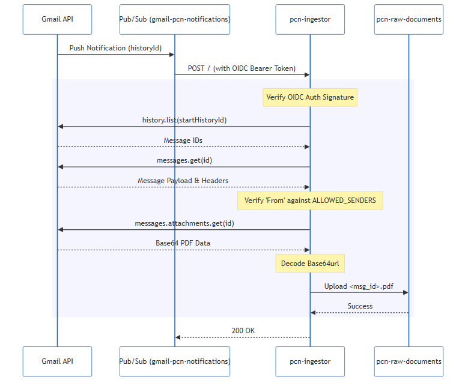
</p>

<p align="center">
  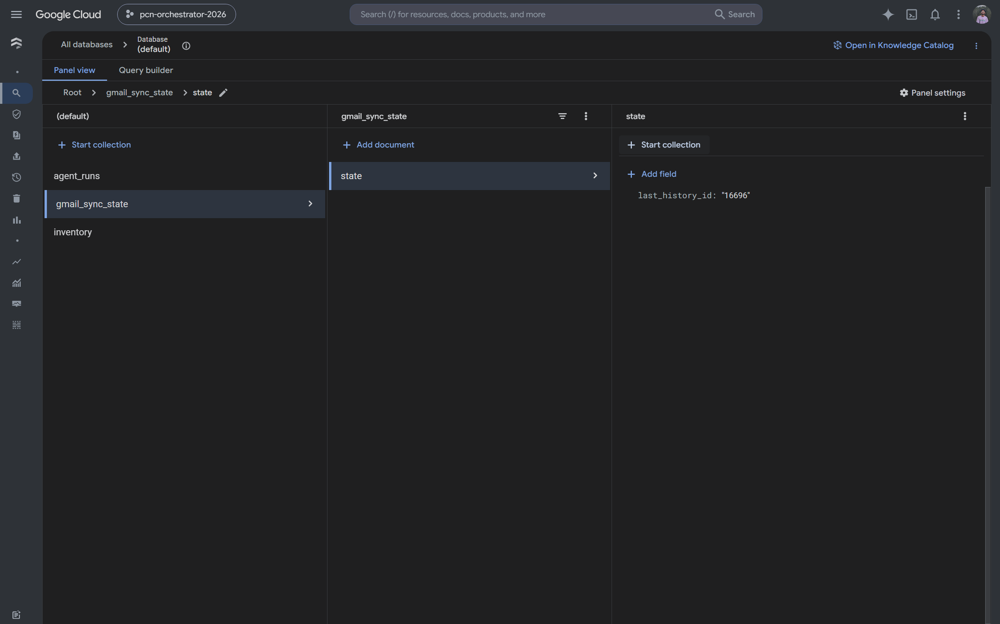
  <br>
  <em>The live <code>gmail_sync_state</code> document — a single field, <code>last_history_id</code>, tracking exactly where ingestion left off.</em>
</p>

### 2. Multi-Agent Pipeline Flow
The full decision tree inside `pcn-agent`: OIDC verification, redelivery idempotency check, cost guard, and the three-stage Triage → Resolution → Action pipeline with every terminal outcome. Stage 2 resolves each extracted part against the `inventory` collection:

<p align="center">
  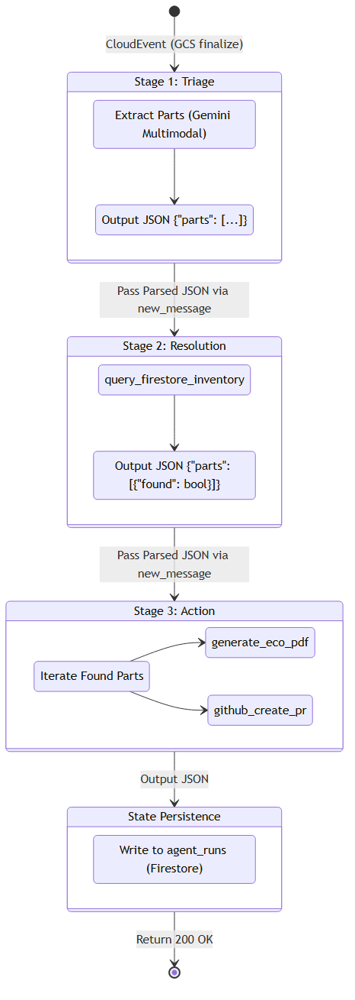
</p>

<p align="center">
  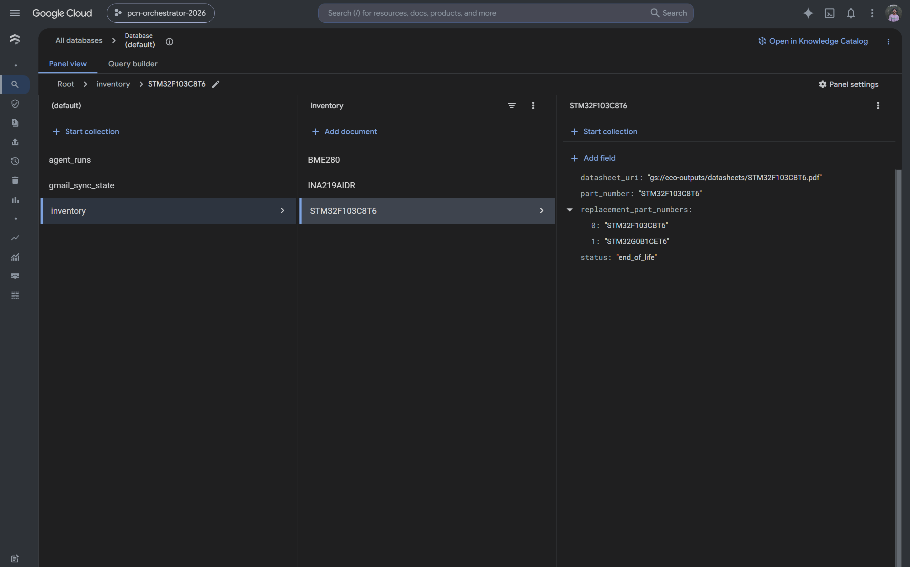
  <br>
  <em>One seeded inventory record — the exact schema Stage 2 queries against.</em>
</p>

### 3. System Architecture
The complete system in context — external services (Gmail, GitHub, Vertex AI) and every internal GCP component.

<p align="center">
  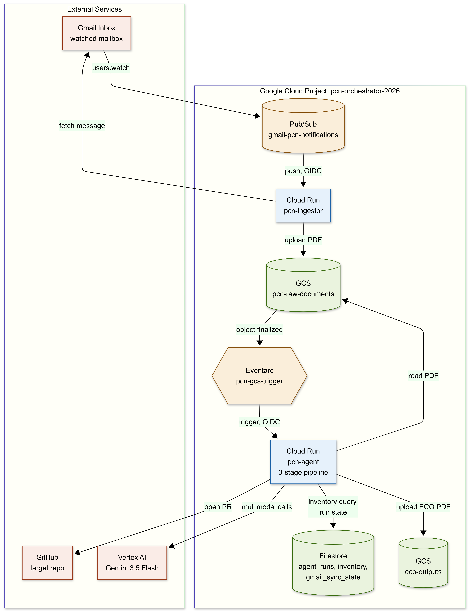
</p>

---

## Example Run

A real, complete run — not a mocked example. Source PDF: a genuinely scanned, zero-text-layer PCN naming two components, sent via the real Gmail trigger shown above.

**Cloud Run logs — full pipeline, including a Pub/Sub redelivery correctly skipped:**

<p align="center">
  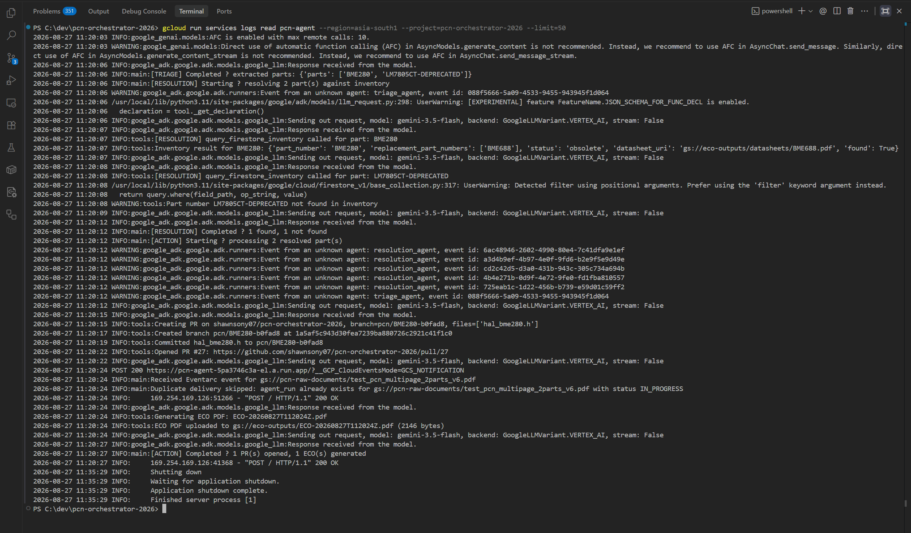
</p>

**Resulting Firestore `agent_runs` document:**
```json
{
  "gcs_uri": "gs://pcn-raw-documents/test_pcn_multipage_2parts_v3.pdf",
  "target_repo": "https://github.com/shawnsony07/pcn-orchestrator-2026",
  "status": "COMPLETED",
  "extracted_parts": [
    {
      "part_number": "BME280",
      "found": true,
      "replacement_found": true,
      "pr_url": "https://github.com/shawnsony07/pcn-orchestrator-2026/pull/27",
      "eco_url": "gs://eco-outputs/ECO-20260827T105830Z.pdf",
      "status": "COMPLETED"
    },
    {
      "part_number": "LM7805CT-DEPRECATED",
      "found": false,
      "replacement_found": false,
      "pr_url": null,
      "eco_url": null,
      "status": "NO_INVENTORY_MATCH"
    }
  ],
  "timestamp": "2026-08-27T10:58:33Z"
}
```

<p align="center">
  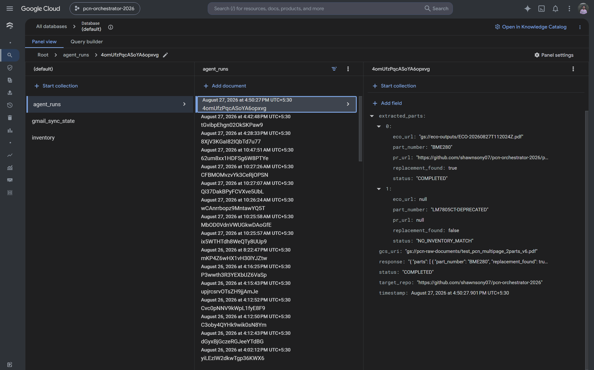
  <br>
  <em>The same structured result, live in Firestore — one found part completed, one correctly reported as no match.</em>
</p>

**Resulting artifacts:**
- GitHub PR: `pcn/BME280-b0fad8` (PR #27) — modifies `hal_bme280.h`
- ECO PDF: `gs://eco-outputs/ECO-20260827T105830Z.pdf` (See `outputs/` for locally downloaded examples of agent-generated ECOs)
- The second part (`LM7805CT-DEPRECATED`) correctly produced **no PR and no ECO** — the inventory lookup failed cleanly and the pipeline reported it rather than inventing a fix.

<p align="center">
  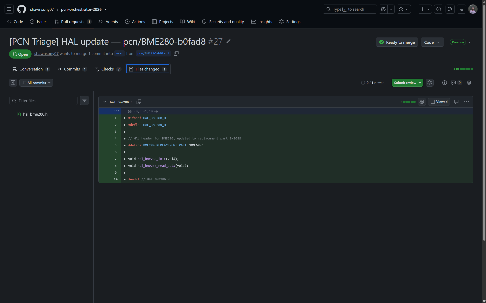
  <br>
  <em>The actual diff — <code>hal_bme280.h</code>, correctly extensioned (see the filename-mangling bug in Findings & Learnings).</em>
</p>

<p align="center">
  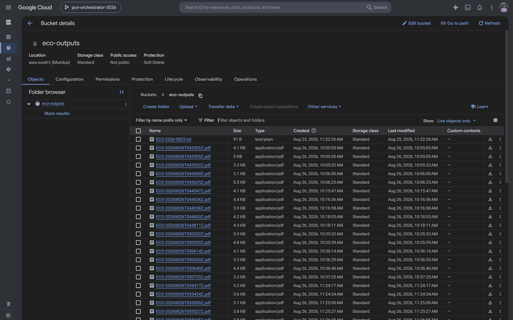
  <br>
  <em>Every ECO PDF generated across all test runs, landing in <code>eco-outputs</code>.</em>
</p>

One input document, two parts, two independently correct outcomes, in a single autonomous run.

---

## Security & Cost Safety Nets

1. **Sender Allowlist** — the ingestor checks the `From` header against `ALLOWED_SENDERS` before any processing. Confirmed rejecting real unauthorized senders in production:

   <p align="center">
     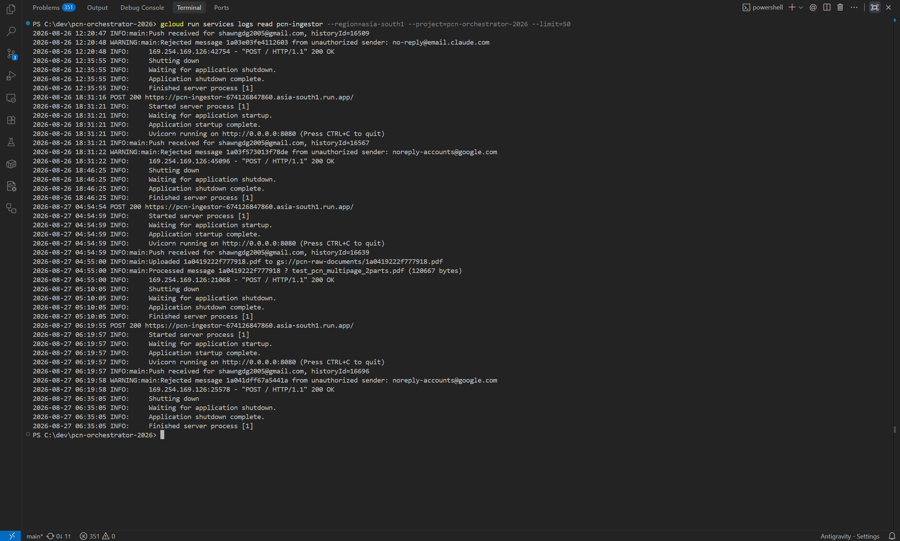
     <br>
     <em>Real rejected messages — <code>no-reply@email.claude.com</code>, <code>noreply-accounts@google.com</code> — neither in <code>ALLOWED_SENDERS</code>, both correctly dropped before any processing.</em>
   </p>

2. **Locked-Down Ingress** — both Cloud Run services run `--no-allow-unauthenticated`, relying on OIDC bearer tokens from Eventarc and Pub/Sub respectively. Nothing else can invoke either service.

   <p align="center">
     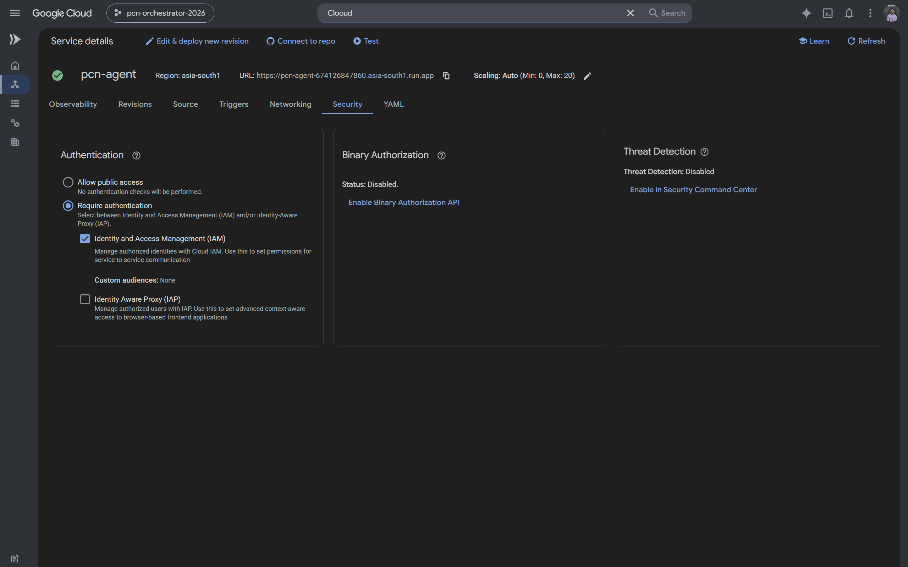
     <br>
     <em>"Require authentication" with IAM enforced — confirmed on <code>pcn-agent</code>.</em>
   </p>

3. **Keyless IAM Auth** — Application Default Credentials only, everywhere. No service account key JSON files exist.
4. **Cost Guard** — a 5MB size limit on incoming GCS objects, checked before any LLM call; unreadable size metadata fails closed (rejected), never assumed safe.
5. **No Fabricated Replacements** — an unresolved part is reported as `NO_INVENTORY_MATCH`, never guessed. See the Firestore document in [Example Run](#example-run) — a real failure mode caught during development (see Findings & Learnings).
6. **Deterministic, Idempotent PR Branching** — branch names computed in code from part number + document hash, never left to model discretion. A retriggered run for the same document reuses the branch instead of duplicating the PR.
7. **Redelivery-Safe Processing** — Pub/Sub and Eventarc use at-least-once delivery and can redeliver the same event. Before any Gemini call, the pipeline checks Firestore for an existing terminal-status run against the same source document and skips redundant processing — visible directly in the [Example Run](#example-run) log excerpt.
8. **Isolated, Proven Per-Stage Retries** — a failure in any one stage retries only that stage, verified against a real production crash (not just a simulated one — see Architecture Decisions).
9. **Strict Model Pinning** — locked to `gemini-3.5-flash` specifically, not a `-latest` alias, for predictable behavior and cost.
10. **GCS Lifecycle Policy** — both buckets auto-delete objects after 7 days, bounding storage cost regardless of test volume (see the Provisioning Guide, step 2).

---

## Known Limitations

- **Gmail watch requires manual renewal** every ~7 days until a Cloud Scheduler job is deployed. If it lapses, the ingestor silently stops receiving new-mail notifications — no error is raised.
- **One commit per file in generated PRs** — the GitHub Contents API produces one commit per modified file rather than a single atomic multi-file commit. A deliberate tradeoff (see Architecture Decisions), acceptable for the current single-file HAL update case.
- **No concurrency/load testing** — validated against individual test documents in sequence, not under simultaneous load.

---

## Operational Maintenance

### Gmail Watch Renewal

`users.watch()` expires every **~7 days**. Until Cloud Scheduler automation is deployed, renew manually:

```bash
cd scripts
pip install google-auth google-api-python-client
set -a && source ../.env && set +a
python gmail_watch_renew.py
```

**Planned Cloud Scheduler setup** (package `gmail_watch_renew.py` as a Cloud Run Job first):
```bash
gcloud scheduler jobs create http gmail-watch-renew \
  --schedule="0 0 * * 0" \
  --uri="<cloud-run-job-url>" \
  --oidc-service-account-email=pcn-agent-sa@<your-gcp-project-id>.iam.gserviceaccount.com \
  --location=asia-south1
```

### Dead-Letter Retention

Eventarc's own Pub/Sub subscription redirects messages to `pcn-dead-letter-topic` after 5 failed delivery attempts. A pull subscription on that topic retains anything that ever lands there for inspection, rather than discarding it silently:
```bash
gcloud pubsub subscriptions create pcn-dead-letter-sub --topic=pcn-dead-letter-topic --project=<your-gcp-project-id>
gcloud pubsub subscriptions pull pcn-dead-letter-sub --auto-ack --project=<your-gcp-project-id>
```

<p align="center">
  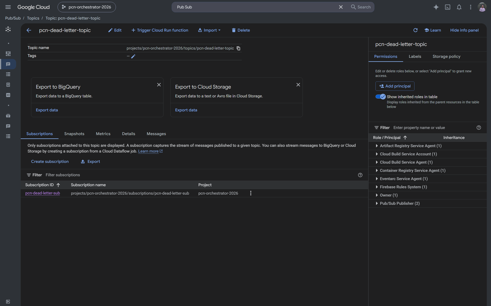
  <br>
  <em><code>pcn-dead-letter-sub</code> now attached — the topic previously warned that undelivered messages would be lost with no subscription retaining them; this closes that gap.</em>
</p>

---

## Cost Considerations

- **Model choice:** `gemini-3.5-flash`, not a larger/slower model — fast and inexpensive per call, sufficient for structured extraction and short reasoning chains.
- **Scale-to-zero compute:** both Cloud Run services run with `min-instances=0` — no cost when idle between PCNs.

  <p align="center">
    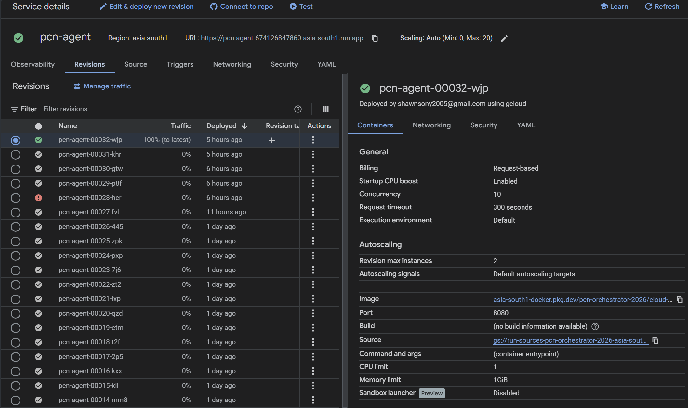
    <br>
    <em>Scaling: Auto (Min: 0, Max: 20) — confirmed on the live service.</em>
  </p>

  <p align="center">
    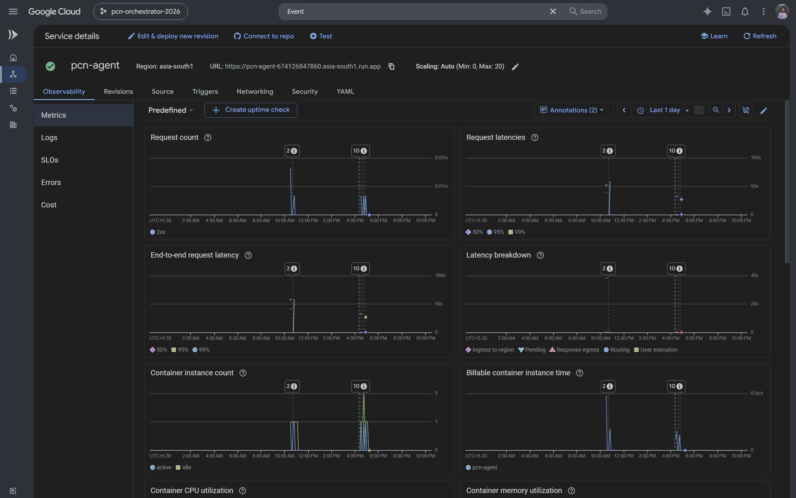
    <br>
    <em>Request count and container instance graphs — traffic only spikes during actual test runs, idle the rest of the time.</em>
  </p>

- **Cost guard:** the 5MB PDF size limit bounds worst-case per-run token spend before any LLM call happens.
- **Redelivery protection:** directly prevents duplicate Gemini spend on the same input (see Architecture Decisions) — a real, measured fix, not a theoretical one.
- **GCS lifecycle policy:** 7-day auto-delete on both buckets bounds storage cost independent of test volume.

---

## Technologies Used

Google ADK 2.0 · Gemini 3.5 Flash (Vertex AI) · Google Cloud Run · Google Cloud Eventarc · Google Cloud Pub/Sub · Google Cloud Firestore · Google Cloud Storage · Gmail API · FastAPI · PyGithub · reportlab · Python 3.11

---

## Findings & Learnings

The real value of this section: every item below is a bug that was caught in **live production testing**, not a hypothetical.

1. **LLM hallucination without real input.** Before native multimodal reading was implemented, the agent was given only a bare `gs://` URI as text, with no way to actually read the referenced file. Rather than failing, it invented a plausible-sounding part number (`BME280`) that had nothing to do with the actual test document. Nine PRs were opened against this fabricated data before the gap was identified and closed with `Part.from_uri()` native multimodal input.

2. **`SequentialAgent` cannot resume mid-pipeline.** Assumed early on that ADK's built-in sequential composition plus an outer retry loop would correctly retry only a failed stage. Empirical testing proved otherwise — it restarts the whole sequence. Led directly to the manual 3-stage `Runner` architecture (see Architecture Decisions).

3. **Cost guard must fail closed.** An early version of the size-check guard defaulted to "assume small enough" if the GCS metadata read itself failed — backwards for a guard whose entire purpose is stopping expensive runs. Fixed to fail closed: an unreadable size is rejected, not assumed safe.

4. **Pub/Sub/Eventarc redelivery caused duplicate full pipeline runs.** Caught directly in Cloud Run logs — one GCS upload, two complete Triage→Resolution→Action runs, ~19 seconds apart. Google's at-least-once delivery guarantee is documented behavior, not a fluke, and the fix (a Firestore pre-check before Stage 1) is now a permanent architectural feature, not a patch.

5. **JSON function-calling schemas silently mangle special characters in dictionary keys.** When `github_create_pr` accepted `hal_modifications` as a `{filename: content}` dictionary, the LLM's function-call schema layer sanitized the dot in `hal_bme280.h` — producing `hal_bme280_h`, and in one case a zero-width-space-mangled filename entirely. The fix wasn't a patch on the symptom (regex-restoring dots) but a structural one: refactored to a list of `{"path": ..., "content": ...}` objects, so the filename is a *value*, never a dictionary *key*, and is never subject to schema-name sanitization at all.

6. **"The pipeline completed successfully" and "the pipeline produced correct output" are different claims.** Several of the above were caught specifically because the actual GitHub PR diff was inspected directly (via the `gh` CLI or the PR page itself), not just the Cloud Run exit logs. A clean `200 OK` response does not by itself prove the artifact it produced is correct.
